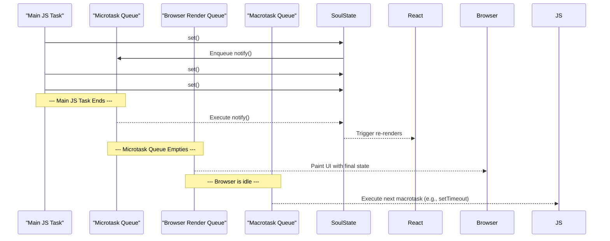

import { CodeBlock } from '../../components/code-block';
import { Callout } from '../../components/callout';

# Internals: Batching Engine

SoulState's batching engine is fundamental to its performance and UI consistency. It ensures that multiple, rapid-fire state updates are processed efficiently, resulting in a single, atomic render. Unlike older libraries that required manual batching, SoulState's batching is automatic and built into the core `set` function.

## The Engine: `queueMicrotask`

The entire batching engine is powered by a single browser/JS API: `queueMicrotask`.

When you call `store.set()`, the following happens:

1.  The state object is updated synchronously.
2.  The store checks a boolean flag, `isNotificationScheduled`.
3.  If `false`, it sets the flag to `true` and calls `queueMicrotask(notifySubscribers)`.
4.  If `true`, it does nothing, because a notification is already pending.

This simple mechanism guarantees that no matter how many times you call `set` within a single synchronous block of code (like a click handler), the `notifySubscribers` function will only be executed **once**.

### Source Code Analysis

Here is the relevant snippet from the `createStore` implementation:

<CodeBlock language="typescript" code={`
export function createStore<T extends object>(initialState: T): Store<T> {
  let state: T = initialState;
  const subscriptionManager = createSubscriptionManager<T>();

  // The flag that enables batching
  let isNotificationScheduled = false;
  let lastKnownState = state;

  const notifySubscribers = () => {
    subscriptionManager.notify(state, lastKnownState);
    lastKnownState = state;
    // Reset the flag after notification
    isNotificationScheduled = false;
  };

  const scheduleNotification = () => {
    if (!isNotificationScheduled) {
      isNotificationScheduled = true;
      // Schedule the notification in the microtask queue
      queueMicrotask(notifySubscribers);
    }
  };

  const set = (updater: StateUpdater<T>) => {
    // ... state update logic ...
    const nextState = { ...state, ...(partialState as Partial<T>) };
    state = nextState;
    
    // Schedule the single, batched notification
    scheduleNotification();
  };

  // ...
}
`} />

## Microtask vs. Macrotask (e.g., `setTimeout`)

The choice of `queueMicrotask` over `setTimeout(..., 0)` (a macrotask) is deliberate and critical.

-   **Microtasks** run immediately after the current JavaScript task has finished, but *before* the browser performs any rendering or I/O. This is the perfect time to notify subscribers, as it ensures that all state updates are processed before the next frame is painted.
-   **Macrotasks** (like `setTimeout`) are scheduled for a future task. Using `setTimeout` could lead to a perceptible delay and would allow the browser to render intermediate, "torn" states between the end of the current task and the execution of the timeout callback.

### Batching Timeline Diagram

This diagram shows the precise execution order within the JavaScript event loop.

<Callout type="success" title="The Benefit">
By using the microtask queue, SoulState guarantees that the UI will never show an incomplete state. All updates from a single user interaction are processed and rendered together, resulting in a smooth and consistent user experience. This completely eliminates the possibility of UI tearing.
</Callout>
