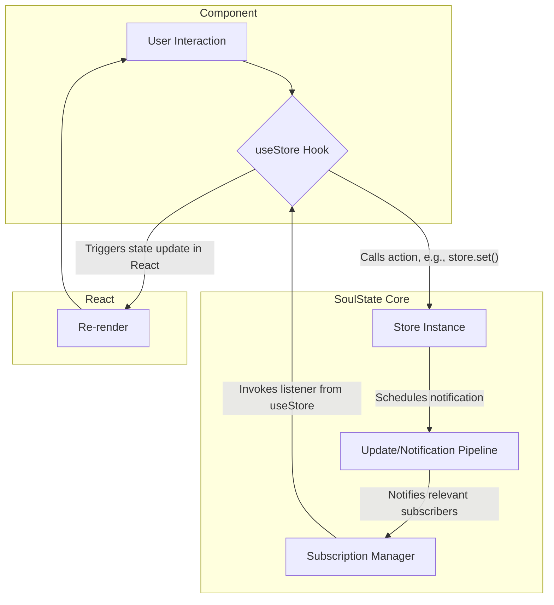

import CodeBlock from '@theme/CodeBlock';
import { Admonition } from '@site/src/components/Admonition';

# System Architecture

This document provides a high-level overview of SoulState's internal architecture. Understanding these core components is key to grasping how the library achieves its performance and simplicity.

## Core Components

SoulState's architecture can be broken down into three main systems:

1.  **The Store**: A singleton object that holds the state and the `set`, `get`, and `subscribe` methods. It is the single source of truth.
2.  **The Subscription Manager**: A highly efficient system for managing listeners (primarily from `useStore` hooks). It is responsible for tracking who is listening to what.
3.  **The Update & Notification Pipeline**: A batched process that handles state changes and notifies the relevant subscribers.

### System Flow Diagram

This diagram illustrates how a user action flows through the entire system to result in a UI update.

## 1. The Store (`createStore`)

The `createStore` function is a factory that produces a `Store` object. Internally, this object is a closure that encapsulates:
- `state`: The current state object.
- `subscriptionManager`: An instance of the subscription manager.
- `set`, `get`, `subscribe`: The public API methods that operate on the `state` and `subscriptionManager`.

The key design choice here is that the state is just a simple JavaScript object, and the store itself is a plain object with methods. There are no complex classes or prototypes, which keeps the library lightweight and predictable.

## 2. The Subscription Manager

This is arguably the most critical piece of SoulState's performance story.

-   **Data Structure**: Instead of a simple array (which would have O(n) complexity for unsubscribing), SoulState uses a **doubly linked list** to store its subscriptions.
-   **Performance**: This allows for **O(1)** (constant time) complexity for both `subscribe` (add) and `unsubscribe` (remove) operations. When a component unmounts, its subscription can be removed instantly without iterating over the entire list of subscribers. This is vital for performance in applications with many dynamic components.

<Admonition type="info" title="Why Not a Map or Set?">
  
While <code>Map</code> or <code>Set</code> also offer O(1) average time complexity for add/delete, a linked list provides a direct, iterable sequence without the overhead of an iterator object. During notifications, the system can traverse the list via simple <code>next</code> pointers, which is one of the fastest ways to iterate a collection.

</Admonition>

## 3. The Update & Notification Pipeline

This pipeline is designed to be both efficient and safe from UI tearing.

1.  **`set()` is Called**: An action calls `set` with a state update.
2.  **State is Updated**: A new state object is created via structural sharing (`{...state, ...update}`).
3.  **Notification Scheduling**: A call to `notifySubscribers` is scheduled as a **microtask** using `queueMicrotask`. If a notification is already pending in the queue, this step is skipped. This is the **automatic batching** mechanism.
4.  **Microtask Execution**: After the current JavaScript task completes, the event loop processes the microtask queue.
5.  **`notifySubscribers()` Runs**: The subscription manager iterates through the linked list of subscribers.
6.  **Selector Execution**: For each subscriber, its selector function is run against the new state.
7.  **Equality Check**: The result of the selector is compared with the previous result using the subscriber's `equalityFn`.
8.  **Listener Invocation**: If the equality check returns `false`, the subscriber's listener function (the callback provided by `useStore`) is called, triggering a re-render in React.

This entire process ensures that multiple `set` calls in the same event tick result in only a single, batched notification, and components only re-render if the data they care about has actually changed.
