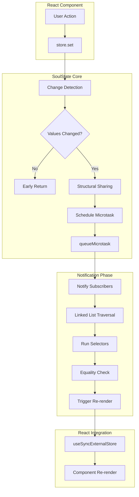

import CodeBlock from '@theme/CodeBlock';
import { Admonition } from '@site/src/components/Admonition';

# System Architecture

This document provides a comprehensive overview of SoulState's internal architecture, explaining how the library achieves optimal performance through intelligent design choices.

## Core Components

SoulState's architecture consists of four main systems working in harmony:

1. **The Store**: Manages state with `get`, `set`, and `subscribe` methods
2. **The Subscription Manager**: Uses doubly linked lists for O(1) operations
3. **The Update Pipeline**: Batches updates with microtasks and structural sharing
4. **React Integration**: Leverages `useSyncExternalStore` for optimal rendering

### System Flow Diagram

## 1. The Store (`createStore`)

The foundation of SoulState - a minimal, performant state container.

<CodeBlock language="typescript">
{`import { createSubscriptionManager } from './subscriptions';

export interface Store<T> {
  get: () => T;
  set: (updater: StateUpdater<T>) => void;
  subscribe: <S>(
    selector: (state: T) => S,
    listener: (selectedState: S, prevSelectedState: S) => void,
    options?: { equalityFn?: (a: S, b: S) => boolean }
  ) => () => void;
}

export function createStore<T extends object>(initialState: T): Store<T> {
  let state: T = initialState;
  const subscriptionManager = createSubscriptionManager<T>();
  let isNotificationScheduled = false;
  let lastKnownState = state;

  const notifySubscribers = () => {
    subscriptionManager.notify(state, lastKnownState);
    lastKnownState = state;
    isNotificationScheduled = false;
  };

  const scheduleNotification = () => {
    if (!isNotificationScheduled) {
      isNotificationScheduled = true;
      queueMicrotask(notifySubscribers);
    }
  };

  const get = (): T => state;

  const set = (updater: StateUpdater<T>) => {
    const partialState = typeof updater === 'function'
      ? (updater as (state: T) => Partial<T> | T)(state)
      : updater;

    if (Object.is(partialState, state) || partialState === undefined) {
      return;
    }

    // Minimal Structural Sharing - check if values actually changed
    let hasChanged = false;
    const updatedKeys = Object.keys(partialState);
    for (let i = 0; i < updatedKeys.length; i++) {
      const key = updatedKeys[i] as keyof T;
      if (!Object.is(state[key], (partialState as T)[key])) {
        hasChanged = true;
        break;
      }
    }

    if (!hasChanged) {
      return; // No actual change - avoid object creation
    }

    // Only create new object if something truly changed
    const nextState = { ...state, ...(partialState as Partial<T>) };
    state = nextState;
    scheduleNotification();
  };

  const subscribe = <S>(
    selector: (state: T) => S,
    listener: (selectedState: S, prevSelectedState: S) => void,
    options?: { equalityFn?: (a: S, b: S) => boolean }
  ) => {
    return subscriptionManager.subscribe(selector, listener, options?.equalityFn, state);
  };

  return { get, set, subscribe };
}
`}
</CodeBlock>

<Admonition type="info" title="Design Philosophy">
  
The store is a simple closure that encapsulates state with minimal overhead. The key innovation is the change detection that prevents unnecessary object creation and the microtask batching that ensures optimal update scheduling.

</Admonition>

## 2. The Subscription Manager

A doubly linked list implementation for optimal subscription management.

<CodeBlock language="typescript">
{`import { objectIs } from '../utils/equality';

// A node in the doubly linked list of subscribers
interface SubscriptionNode<T, S> {
  selector: (state: T) => S;
  listener: (selectedState: S, prevSelectedState: S) => void;
  equalityFn: (a: S, b: S) => boolean;
  lastState: S;
  prev: SubscriptionNode<T, any> | null;
  next: SubscriptionNode<T, any> | null;
}

export function createSubscriptionManager<T>(): SubscriptionManager<T> {
  // Head and tail pointers for the doubly linked list
  let head: SubscriptionNode<T, any> | null = null;
  let tail: SubscriptionNode<T, any> | null = null;

  const subscribe = <S>(
    selector: (state: T) => S,
    listener: (selectedState: S, prevSelectedState: S) => void,
    equalityFn: (a: S, b: S) => boolean = objectIs,
    initialState: T
  ) => {
    const newNode: SubscriptionNode<T, S> = {
      selector,
      listener,
      equalityFn,
      lastState: selector(initialState),
      prev: tail,
      next: null,
    };

    // O(1) insertion at tail
    if (tail) {
      tail.next = newNode;
    } else {
      head = newNode;
    }
    tail = newNode;

    // Return O(1) unsubscribe function
    return () => {
      const { prev, next } = newNode;
      if (prev) {
        prev.next = next;
      } else {
        head = next;
      }
      if (next) {
        next.prev = prev;
      } else {
        tail = prev;
      }
    };
  };

  const notify = (newState: T, prevState: T) => {
    if (Object.is(newState, prevState)) return;

    // Iterate through linked list - no iterator overhead
    let current = head;
    while (current) {
      const sub = current;
      const newSelectedState = sub.selector(newState);
      const lastState = sub.lastState;

      if (!sub.equalityFn(newSelectedState, lastState)) {
        sub.lastState = newSelectedState;
        sub.listener(newSelectedState, lastState);
      }

      current = current.next;
    }
  };

  return { subscribe, notify };
}
`}
</CodeBlock>

<Admonition type="info" title="Why Doubly Linked List?">
  
While <code>Map</code> and <code>Set</code> offer O(1) operations, a doubly linked list provides direct pointer manipulation without iterator creation overhead. This results in faster iteration during notifications and instant O(1) subscription removal.

</Admonition>

## 3. Update Pipeline & Performance Optimizations

SoulState employs multiple optimization strategies for maximum performance.

### Microtask Batching

<CodeBlock language="typescript">
{`let isNotificationScheduled = false;

const scheduleNotification = () => {
  if (!isNotificationScheduled) {
    isNotificationScheduled = true;
    queueMicrotask(notifySubscribers); // Batched!
  }
};

// Multiple updates → single re-render
store.set({ count: 1 });    // 🚫 No immediate notification
store.set({ count: 2 });    // 🚫 No immediate notification  
store.set({ count: 3 });    // 🚫 No immediate notification
// ✅ Single notification with final state
`}
</CodeBlock>

### Structural Sharing & Change Detection

<CodeBlock language="typescript">
{`// Instead of blind object spreading, check for actual changes
let hasChanged = false;
const updatedKeys = Object.keys(partialState);
for (let i = 0; i < updatedKeys.length; i++) {
  const key = updatedKeys[i] as keyof T;
  if (!Object.is(state[key], (partialState as T)[key])) {
    hasChanged = true;
    break;
  }
}

if (!hasChanged) {
  return; // Skip object creation and notifications
}

// Only create new object when necessary
const nextState = { ...state, ...(partialState as Partial<T>) };
`}
</CodeBlock>

### Selective Notification

<CodeBlock language="typescript">
{`// Only notify subscribers whose selected data changed
if (!sub.equalityFn(newSelectedState, lastState)) {
  sub.lastState = newSelectedState;
  sub.listener(newSelectedState, lastState); // Trigger re-render
}
`}
</CodeBlock>

## 4. React Integration

Seamless integration with React 18+ using modern concurrent features.

<CodeBlock language="typescript">
{`import * as React from 'react';
import { Store } from '../core/store';
import { objectIs } from '../utils/equality';
import { shallow } from '../utils/shallow';

// Use React 18's useSyncExternalStore when available
const useSyncExternalStore =
  React.useSyncExternalStore ||
  ((subscribe, getSnapshot) => {
    const value = getSnapshot();
    const [state, setState] = React.useState(value);
    React.useLayoutEffect(() => {
      const unsubscribe = subscribe(() => {
        const nextValue = getSnapshot();
        if (!Object.is(value, nextValue)) {
          setState(nextValue);
        }
      });
      return unsubscribe;
    }, [subscribe, getSnapshot]);
    return state;
  });

export function useStore<T, S>(
  store: Store<T>,
  selector: (state: T) => S,
  equalityFn: (a: S, b: S) => boolean = objectIs
): S {
  const getSnapshot = React.useCallback(() => selector(store.get()), [store, selector]);

  const subscribe = React.useCallback(
    (onStoreChange: () => void) => {
      const unsubscribe = store.subscribe(selector, onStoreChange, { equalityFn });
      return unsubscribe;
    },
    [store, selector, equalityFn]
  );

  const value = useSyncExternalStore(subscribe, getSnapshot, getSnapshot);
  return value;
}

// Convenience hook for shallow object comparisons
export const useShallow = <T, S>(store: Store<T>, selector: (state: T) => S) => 
  useStore(store, selector, shallow);
`}
</CodeBlock>

## 5. Utility Functions

SoulState provides optimized utilities for common patterns.

### Equality Functions

<CodeBlock language="typescript">
{`// Default referential equality
export const objectIs = (a: any, b: any): boolean => Object.is(a, b);

// Shallow object comparison
export const shallow = <T, U>(a: T, b: U): boolean => {
  if (Object.is(a, b)) return true;
  if (typeof a !== 'object' || a === null || typeof b !== 'object' || b === null) {
    return false;
  }

  const keysA = Object.keys(a);
  const keysB = Object.keys(b);
  if (keysA.length !== keysB.length) return false;

  for (let i = 0; i < keysA.length; i++) {
    const key = keysA[i];
    if (!Object.prototype.hasOwnProperty.call(b, key) || 
        !Object.is((a as any)[key], (b as any)[key])) {
      return false;
    }
  }
  return true;
};
`}
</CodeBlock>

## Performance Characteristics

### Time Complexity
- **Subscription Management**: O(1) for add/remove
- **State Updates**: O(k) where k = changed properties
- **Notifications**: O(n) where n = active subscriptions
- **Selector Execution**: O(1) per subscription

### Space Complexity  
- **Store**: O(1) additional memory
- **Subscriptions**: O(n) where n = active subscriptions

## Best Practices

### ✅ Do:
- Use precise selectors to subscribe to minimal data
- Leverage `shallow` equality for object selections
- Trust automatic batching for multiple updates
- Keep selectors pure and dependency-free

### ❌ Don't:
- Select entire state objects unnecessarily
- Create new objects in selectors without proper equality
- Mutate state directly - always use `set()`
- Worry about micro-optimizations - SoulState handles them

<Admonition type="warning" title="Anti-Pattern: Over-Subscription">
  
Avoid subscribing to more state than necessary. Each subscription adds overhead during notifications. Use surgical selectors to subscribe only to the data your component actually needs.

</Admonition>

## Key Takeaways

1. **Minimal Overhead**: O(1) subscription management with automatic batching
2. **Predictable Updates**: Microtask-based pipeline ensures consistency
3. **React Optimized**: Built on `useSyncExternalStore` for concurrent features
4. **Developer Friendly**: Simple API with sophisticated optimizations

<Admonition type="success" title="Architecture Summary">
  
SoulState combines a minimal store interface with a highly optimized subscription system and batched update pipeline. This architecture delivers exceptional performance while maintaining a simple, predictable developer experience.

</Admonition>
