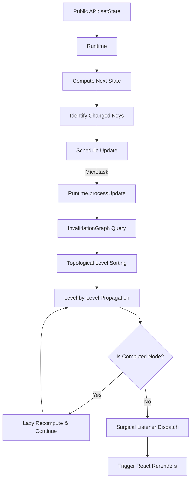

import CodeBlock from '@theme/CodeBlock';
import { Admonition } from '@site/src/components/Admonition';

# System Architecture

SoulState's architecture is built on three systems-grade pillars: **Invalidation Graph Propagation**, **Deterministic Scheduling**, and **Proxy-Based Tracking**. This document details how these systems interact to provide a high-performance granular reactive runtime.

## Core Runtime Systems

SoulState's runtime is divided into specialized modules that handle distinct parts of the state lifecycle.

1.  **StoreApi**: The public interface providing `getState`, `setState`, `subscribe`, `computed`, and `destroy`.
2.  **Runtime**: The central orchestrator managing the state transition and propagation pipeline.
3.  **InvalidationGraph**: A Directed Acyclic Graph (DAG) that maps state keys to their direct and indirect dependents (computeds and subscribers).
4.  **SubscriptionManager**: Optimized dual linked-list management for global and granular subscribers with bitmask fast-paths.
5.  **Scheduler**: A microtask-based deterministic batching engine.
6.  **TransactionEngine**: A transaction buffering system with begin/commit/rollback lifecycle.

### Architecture Flow Diagram

```mermaid
graph TD
    A[Public API: setState] --> B[Runtime];
    B --> C[Compute Next State];
    C --> D[Identify Changed Keys];
    D --> E[Schedule Update];
    E -->|Microtask| F[Runtime.processUpdate];
    F --> G[InvalidationGraph Query];
    G --> H[Topological Level Sorting];
    H --> I[Level-by-Level Propagation];
    I --> J{Is Computed Node?};
    J -->|Yes| K[Lazy Recompute & Continue];
    J -->|No| L[Surgical Listener Dispatch];
    K --> I;
    L --> M[Trigger React Rerenders];
```

## 1. The Runtime & State Pipeline

The `Runtime` (in `src/core/runtime.ts`) manages the transition from the current state to the next.

### Deterministic Updates
Every update follows a strict path:
1.  **Synchronous State Apply**: The internal state is updated immediately when `setState` is called.
2.  **Key Tracking**: SoulState identifies which top-level keys changed during the update.
3.  **Deferred Propagation**: To ensure deterministic ordering and batching, propagation is deferred to the next microtask via the `Scheduler`.

## 2. Invalidation Graph & Sparse Updates

The `InvalidationGraph` (in `src/internals/graph.ts`) is the heart of SoulState. It treats your state and its derivatives as a **Reactive Graph**.

### Surgical Tracking
When a component or computed value accesses a state key, it is registered as a dependent in the graph. SoulState uses a **Reusable Tracking Proxy** (in `src/internals/invalidation.ts`) to detect these dependencies with minimal GC overhead.

### Level-Based Propagation
To eliminate "glitches" (inconsistent intermediate states), SoulState assigns a **topological level** to every node in the graph:
- **State Keys**: Level 0.
- **Direct Dependents**: Level 1.
- **Deeply Nested Computeds**: Level 2+.

Updates are processed level-by-level, ensuring that a computed value only re-runs after all its own dependencies have been updated.

## 3. Irrelevant Update Elimination

SoulState's most powerful feature is its ability to **eliminate irrelevant work**.

1.  **Surgical Filtering**: If `state.a` changes, the graph immediately knows exactly which specific subscribers need to be notified.
2.  **Equality Fast-Path**: If a computed value recomputes but its result is `Object.is` equal to its previous value, SoulState **stops propagation** down that specific branch of the graph.
3.  **No-Op Skipping**: If `setState` is called with values identical to the current state, the entire propagation cycle is bypassed.
4.  **Bypass Fast-Path**: If no granular listeners are active for the changed keys, SoulState bypasses the propagation engine entirely to minimize overhead.

## 4. Optimized Subscription Management

The `SubscriptionManager` (in `src/core/subscriptions.ts`) uses dual **doubly linked lists** to separate global and granular subscribers.

### Benefits:
- **O(1) Teardown**: Removing a subscription is a simple pointer update, critical for high-churn UIs.
- **Filtered Iteration**: Separation of global listeners ensures that granular updates don't waste cycles iterating over unrelated subscribers.
- **Memory Efficiency**: Avoids array resizing and minimizes allocation churn during frequent mount/unmount cycles.

## 5. React Integration

SoulState integrates with React using `useSyncExternalStore`, providing:
- **Concurrent Safety**: No UI "tearing" during concurrent rendering.
- **Surgical Rerenders**: Only components whose specific data slice changed will re-render.
- **Stable Hook Lifecycles**: Automatic cleanup and deterministic consistency.

## Complexity Comparison

| Operation | Global Broadcast (Zustand) | Atomic (Jotai) | **SoulState (Reactive Graph)** |
| :--- | :--- | :--- | :--- |
| **State Organization** | Centralized | Decentralized | **Centralized (Single Tree)** |
| **Notification Scope** | O(N) Global | O(1) Atomic | **O(M) Surgical** |
| **Deep Dependencies** | Manual Optimization | Automatic | **Automatic & Deterministic** |
| **Scale Stability** | Degrades at 10k+ | High | **Extremely High (100k+)** |

---

<Admonition type="success" title="Systems-Grade Engineering">
  
SoulState is designed for developers who need the architectural clarity of a centralized store without the performance penalties of global broadcast. Its reactive graph architecture ensures that your application remains responsive at any scale.

</Admonition>
