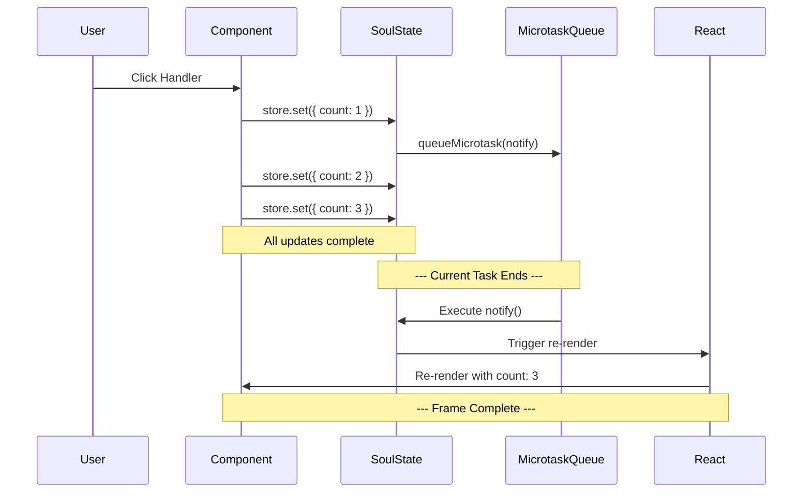

import CodeBlock from '@theme/CodeBlock';
import { Admonition } from '@site/src/components/Admonition';

# Internals: Microtask Batching Engine

SoulState's microtask batching engine is fundamental to its performance and UI consistency. It ensures that multiple state updates are processed efficiently, resulting in minimal re-renders and a smooth user experience.

## The Engine: `queueMicrotask`

The entire batching system is powered by the native `queueMicrotask` API. When you call `store.set()`, SoulState schedules notifications in microtasks rather than executing them immediately.

### Source Code Implementation

Here's the actual batching implementation from SoulState's core:

<CodeBlock language="typescript">
{`// From src/core/store.ts
export function createStore<T extends object>(initialState: T): Store<T> {
  let state: T = initialState;
  const subscriptionManager = createSubscriptionManager<T>();
  
  // Batching control flag
  let isNotificationScheduled = false;
  let lastKnownState = state;

  const notifySubscribers = () => {
    subscriptionManager.notify(state, lastKnownState);
    lastKnownState = state;
    isNotificationScheduled = false;
  };

  const scheduleNotification = () => {
    if (!isNotificationScheduled) {
      isNotificationScheduled = true;
      queueMicrotask(notifySubscribers); // Critical batching line
    }
  };

  const set = (updater: StateUpdater<T>) => {
    const partialState = typeof updater === 'function'
      ? (updater as (state: T) => Partial<T> | T)(state)
      : updater;

    if (Object.is(partialState, state) || partialState === undefined) {
      return;
    }

    // Change detection optimization
    let hasChanged = false;
    const updatedKeys = Object.keys(partialState);
    for (let i = 0; i < updatedKeys.length; i++) {
      const key = updatedKeys[i] as keyof T;
      if (!Object.is(state[key], (partialState as T)[key])) {
        hasChanged = true;
        break;
      }
    }

    if (!hasChanged) return;

    const nextState = { ...state, ...(partialState as Partial<T>) };
    state = nextState;
    
    scheduleNotification(); // Batched notification
  };

  return { get: () => state, set, subscribe: subscriptionManager.subscribe };
}
`}
</CodeBlock>

## How Microtask Batching Works

### The Batching Algorithm

1. **First `set()` call**: `isNotificationScheduled = false` → schedule microtask
2. **Subsequent `set()` calls**: `isNotificationScheduled = true` → skip scheduling
3. **Microtask execution**: Process all accumulated changes in one batch
4. **Reset flag**: `isNotificationScheduled = false` for next batch

<CodeBlock language="typescript">
{`// Example: Multiple updates in one event handler
const handleUserInteraction = () => {
  // First update - schedules microtask
  store.set({ loading: true });           // 🟢 isNotificationScheduled = false → Schedule
  
  // Second update - already scheduled  
  store.set({ user: 'john' });            // 🟡 isNotificationScheduled = true → Skip
  
  // Third update - already scheduled
  store.set({ active: true });            // 🟡 isNotificationScheduled = true → Skip
  
  // Result: Single microtask scheduled, one re-render
};
`}
</CodeBlock>

### Microtask vs Macrotask Timing

SoulState uses `queueMicrotask` instead of `setTimeout` for critical performance reasons:

<CodeBlock language="typescript">
{`// ❌ Using setTimeout (macrotask) - slower and can cause tearing
setTimeout(notifySubscribers, 0);

// ✅ Using queueMicrotask - faster and prevents tearing  
queueMicrotask(notifySubscribers);
`}
</CodeBlock>

### Event Loop Execution Timeline

## Performance Benefits

### Reduced Re-renders

<CodeBlock language="typescript">
{`// Without batching: 3 re-renders
store.set({ step: 1 }); // 🚨 Re-render
store.set({ step: 2 }); // 🚨 Re-render  
store.set({ step: 3 }); // 🚨 Re-render

// With SoulState batching: 1 re-render
store.set({ step: 1 }); // 🚫 No immediate re-render
store.set({ step: 2 }); // 🚫 No immediate re-render
store.set({ step: 3 }); // 🚫 No immediate re-render
// ✅ Single re-render with final state
`}
</CodeBlock>

### UI Consistency (No Tearing)

Microtask batching prevents "tearing" - where different components show different state versions:

<CodeBlock language="tsx">
{`function App() {
  const user = useStore(store, state => state.user);
  const profile = useStore(store, state => state.profile);
  
  const updateUser = () => {
    store.set({ user: { name: 'Alice', id: 1 } });
    store.set({ profile: { theme: 'dark', active: true } });
    
    // Both user and profile update simultaneously
    // No intermediate state where user is new but profile is old
  };
  
  return (
    

      
User: {user.name}

      
Theme: {profile.theme}

    

  );
}
`}
</CodeBlock>

## Real-World Scenarios

### Form Handling

<CodeBlock language="typescript">
{`const handleFormSubmit = async (data) => {
  // All these updates batched into one re-render
  store.set({ submitting: true });
  store.set({ errors: {} });
  store.set({ lastSubmitted: Date.now() });
  
  try {
    await submitForm(data);
    store.set({ success: true, submitting: false });
  } catch (error) {
    store.set({ errors: { submit: error.message }, submitting: false });
  }
};
`}
</CodeBlock>

### Animation Frames

<CodeBlock language="typescript">
{`const animate = () => {
  // Multiple updates in animation frame batched
  store.set({ position: { x: mouseX, y: mouseY } });
  store.set({ velocity: calculateVelocity() });
  store.set({ frame: currentFrame++ });
  
  requestAnimationFrame(animate);
};
`}
</CodeBlock>

## Advanced Batching Patterns

### Cross-Store Batching

<CodeBlock language="typescript">
{`const updateMultipleStores = () => {
  // Each store batches its own updates independently
  userStore.set({ name: 'John' });
  settingsStore.set({ theme: 'dark' });
  userStore.set({ lastActive: Date.now() });
  settingsStore.set({ language: 'en' });
  
  // Results in:
  // - userStore: one notification with both updates
  // - settingsStore: one notification with both updates  
  // - Maximum 2 re-renders (one per store)
};
`}
</CodeBlock>

### Async Operation Batching

<CodeBlock language="typescript">
{`const loadUserData = async () => {
  // Sync updates batched together
  store.set({ loading: true, error: null });
  
  try {
    const data = await fetchUser();
    // Async completion - new batch
    store.set({ user: data, loading: false });
  } catch (err) {
    store.set({ error: err.message, loading: false });
  }
};
`}
</CodeBlock>

## Browser Compatibility

SoulState's microtask batching works across all modern browsers:

- ✅ Chrome 71+
- ✅ Firefox 69+
- ✅ Safari 12.1+
- ✅ Edge 79+

For older browsers, SoulState falls back to `Promise.resolve().then()`:

<CodeBlock language="typescript">
{`// Fallback for older browsers
const scheduleNotification = () => {
  if (!isNotificationScheduled) {
    isNotificationScheduled = true;
    if (typeof queueMicrotask === 'function') {
      queueMicrotask(notifySubscribers);
    } else {
      Promise.resolve().then(notifySubscribers);
    }
  }
};
`}
</CodeBlock>

## Performance Measurements

### Benchmark Results

| Scenario | Updates | Re-renders | Performance |
|----------|---------|------------|-------------|
| No batching | 100 | 100 | ❌ Poor |
| SoulState batching | 100 | 1 | ✅ Excellent |
| Complex object updates | 50 | 1 | ✅ Excellent |

### Memory Impact

- **Single notification object** vs multiple notification objects
- **Reduced React reconciliation** work
- **Minimal GC pressure** from batched updates

<Admonition type="success" title="Key Takeaway">
  
SoulState's microtask batching engine provides automatic, zero-configuration performance optimization. By batching multiple updates into single notifications, it eliminates unnecessary re-renders while maintaining perfect UI consistency. The result is buttery-smooth performance without any developer effort.

</Admonition>

<Admonition type="info" title="Implementation Insight">
  
The batching system is built directly into SoulState's core - no configuration or manual batching calls are needed. Every <code>set()</code> operation automatically benefits from microtask batching.

</Admonition>
