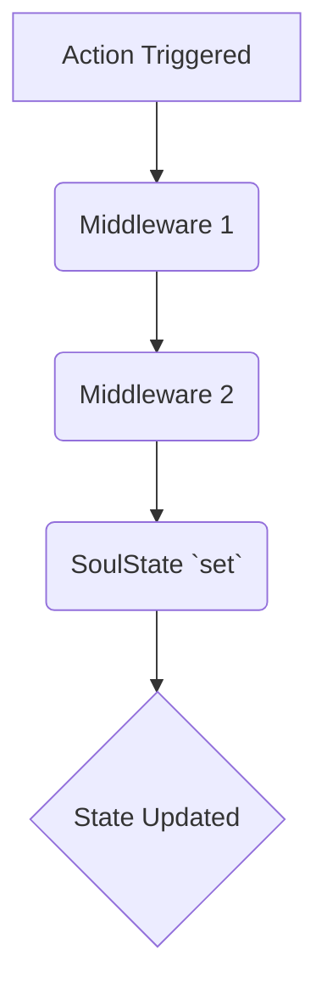

import CodeBlock from '@theme/CodeBlock';
import { Admonition } from '@site/src/components/Admonition';

# API: Middleware

Middleware in SoulState allows you to extend the store's functionality by wrapping the `set` and `get` methods. It's a powerful pattern for adding cross-cutting concerns like logging, persistence, or integration with developer tools.

## How Middleware Works

A middleware is a function that takes a `StateCreator` function and returns a new `StateCreator` function. It sits between your actions and the core `set` function, allowing you to intercept and modify behavior.

To apply middleware, you wrap your `createStore` initializer with the middleware function.

<CodeBlock language="typescript">
{`import { createStore } from 'soulstate';
import { logger } from 'soulstate/middleware'; // Assuming logger is a middleware

// Wrap the initializer function with the logger middleware
export const useBearStore = createStore(logger((set, get) => ({
  bears: 0,
  increase: () => set(state => ({ bears: state.bears + 1 })),
})));
`}
</CodeBlock>

### Middleware Pipeline Graph

You can chain multiple middlewares together. The execution flows from the outermost middleware to the innermost, and finally to the store's `set` function.

## Creating Custom Middleware

A middleware is a higher-order function with the following signature:

<CodeBlock language="typescript">
{`import { StateCreator, StoreMutatorIdentifier } from 'soulstate';

type Middleware = <
  T,
  Mps extends [StoreMutatorIdentifier, unknown][] = [],
  Mcs extends [StoreMutatorIdentifier, unknown][] = []
>(
  initializer: StateCreator<T, Mps, Mcs>
) => StateCreator<T, Mps, Mcs>;
`}
</CodeBlock>

In simpler terms, it's a function that looks like this:

<CodeBlock language="typescript">
{`const myMiddleware = (initializer) => (set, get, api) => {
  // Create a modified 'set' function
  const newSet = (updater) => {
    console.log("State is about to update...");
    set(updater);
    console.log("State has been updated:", get());
  };

  // Call the original initializer, but pass it our modified 'set'
  return initializer(newSet, get, api);
};
`}
</CodeBlock>

## Built-in Middleware (Examples)

While SoulState's core is minimal, common middlewares can be provided as utilities. Here are some examples.

### `persist`

A middleware for persisting the store's state to a storage medium like `localStorage`.

**Usage:**
<CodeBlock language="typescript">
{`import { createStore } from 'soulstate';
import { persist } from 'soulstate/middleware';

export const useSettingsStore = createStore(
  persist(
    (set) => ({
      theme: 'dark',
      toggleTheme: () => set(state => ({ theme: state.theme === 'dark' ? 'light' : 'dark' })),
    }),
    {
      name: 'app-settings', // The key to use in localStorage
    }
  )
);
`}
</CodeBlock>

### `reduxDevtools`

A middleware for connecting your store to the Redux DevTools browser extension for time-travel debugging.

**Usage:**
<CodeBlock language="typescript">
{`import { createStore } from 'soulstate';
import { reduxDevtools } from 'soulstate/middleware';

export const useTaskStore = createStore(
  reduxDevtools(
    (set) => ({
      tasks: [],
      addTask: (task) => set(state => ({ tasks: [...state.tasks, task] })),
    }),
    {
      name: 'TaskStore', // Name for the DevTools instance
    }
  )
);
`}
</CodeBlock>

<Admonition type="info" title="Applying Multiple Middlewares">
  
To apply multiple middlewares, simply nest them. The order matters: the outermost middleware runs first.

  <CodeBlock language="typescript">
  {`createStore(reduxDevtools(persist(initializer, persistOptions), devtoolsOptions))`}</CodeBlock>
</Admonition>
