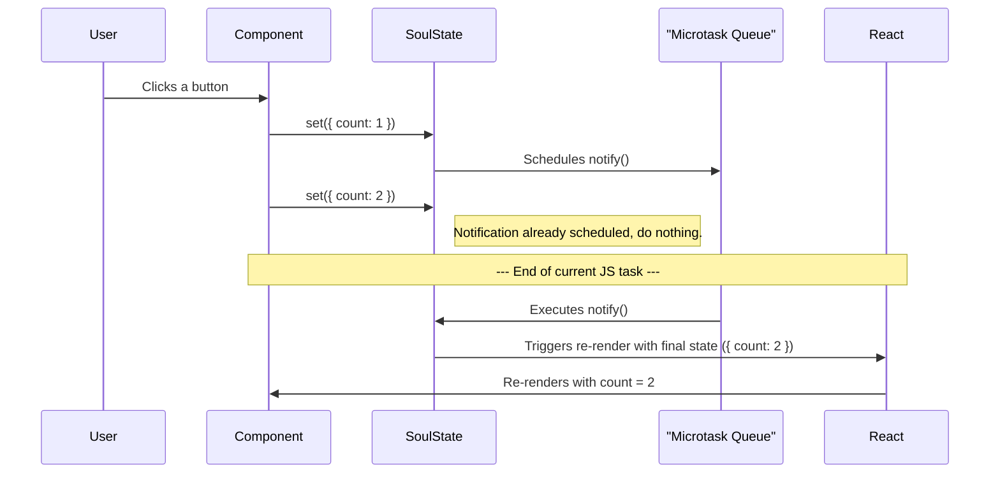

import CodeBlock from '@theme/CodeBlock';
import { Admonition } from '@site/src/components/Admonition';

# Automatic Batching

In a state management library, "batching" is the process of grouping multiple state updates into a single, atomic operation. This is critical for both performance and UI consistency. SoulState performs batching automatically, so you get these benefits for free.

## Automatic Batching with Microtasks

Whenever you call `set`, SoulState does not immediately notify its subscribers. Instead, it schedules a notification to run in a **microtask**.

A microtask is a short function that runs after the current JavaScript task is finished, but before the browser has a chance to repaint the screen.

<CodeBlock language="tsx">
{`import { createStore, useStore } from 'soulstate';

const useCountStore = createStore(set => ({
  count: 0,
  inc: () => set(s => ({ count: s.count + 1 })),
}));

function MyComponent() {
  const inc = useStore(useCountStore, s => s.inc);

  const handleUpdate = () => {
    // These two 'set' calls happen in the same event loop task.
    inc(); // Schedules a notification.
    inc(); // Does NOT schedule a new notification, as one is already pending.
  };

  // Because of automatic batching, the component will only re-render ONCE,
  // with the final state.
  return <button onClick={handleUpdate}>Update</button>;
}
`}
</CodeBlock>

### Why is this important?

1.  **Performance**: It dramatically reduces the number of re-renders. If you have 10 state updates in a single click handler, your components will only render once with the final state, not 10 times.
2.  **Prevents "Tearing"**: Tearing is a UI inconsistency where different components show different state values from the same update batch because they rendered at different times. By batching all notifications and rendering with the final state, SoulState ensures your entire UI is always consistent.

## Update Timeline Diagram

Here’s a visual representation of how SoulState batches updates within a single JavaScript event loop tick.

<Admonition type="tip" title="React 18+ Compatibility">
  
SoulState's microtask batching works perfectly with React's own internal batching and the <code>useSyncExternalStore</code> hook, ensuring robust and predictable behavior in all versions of React 18 and beyond.

</Admonition>
