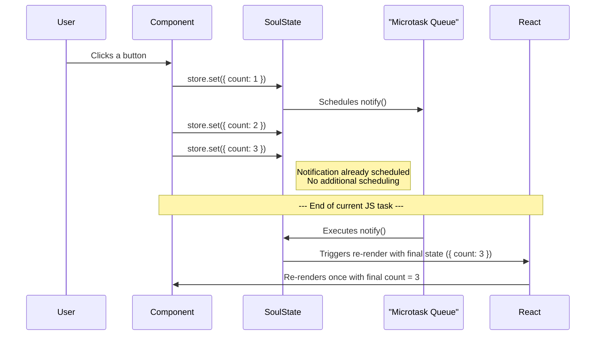

import CodeBlock from '@theme/CodeBlock';
import { Admonition } from '@site/src/components/Admonition';

# Automatic Batching

In a state management library, "batching" is the process of grouping multiple state updates into a single, atomic operation. This is critical for both performance and UI consistency. SoulState performs batching automatically, so you get these benefits for free.

## Automatic Batching with Microtasks

Whenever you call `store.set()`, SoulState does not immediately notify its subscribers. Instead, it schedules a notification to run in a **microtask**.

A microtask is a short function that runs after the current JavaScript task is finished, but before the browser has a chance to repaint the screen.

<CodeBlock language="tsx">
{`import { createStore } from 'soulstate';
import { useStore } from 'soulstate/react';

// Create store with initial state
const counterStore = createStore({ count: 0 });

// Define actions that update the store
const counterActions = {
  increment: () => counterStore.set(state => ({ count: state.count + 1 })),
  incrementBy: (amount: number) => counterStore.set(state => ({ count: state.count + amount })),
};

function MyComponent() {
  const count = useStore(counterStore, state => state.count);

  const handleMultipleUpdates = () => {
    // These three 'set' calls happen in the same event loop task
    counterActions.increment();    // 🚫 No immediate notification
    counterActions.increment();    // 🚫 No immediate notification  
    counterActions.incrementBy(5); // 🚫 No immediate notification
    
    // ✅ All three updates are batched into ONE notification
    // Component will only re-render ONCE with count + 7
  };

  return (
    

      
Count: {count}

      <button onClick={handleMultipleUpdates}>Update Multiple Times</button>
    

  );
}
`}
</CodeBlock>

### Why is this important?

1. **Performance**: It dramatically reduces the number of re-renders. If you have multiple state updates in a single event handler, your components will only render once with the final state.
2. **Prevents "Tearing"**: Tearing is a UI inconsistency where different components show different state values from the same update batch because they rendered at different times. By batching all notifications and rendering with the final state, SoulState ensures your entire UI is always consistent.

## How Microtask Batching Works

SoulState uses a simple but effective batching mechanism:

<CodeBlock language="typescript">
{`// Simplified implementation from src/core/store.ts
let isNotificationScheduled = false;

const scheduleNotification = () => {
  if (!isNotificationScheduled) {
    isNotificationScheduled = true;
    queueMicrotask(notifySubscribers); // Batched!
  }
};

const notifySubscribers = () => {
  subscriptionManager.notify(state, lastKnownState);
  lastKnownState = state;
  isNotificationScheduled = false; // Reset for next batch
};
`}
</CodeBlock>

## Update Timeline Diagram

Here's a visual representation of how SoulState batches updates within a single JavaScript event loop tick.

## Real-World Example: Form Handling

Batching is particularly useful when handling complex form updates:

<CodeBlock language="tsx">
{`import { createStore } from 'soulstate';
import { useStore } from 'soulstate/react';

const formStore = createStore({
  user: { name: '', email: '', age: 0 },
  isValid: false,
  isSubmitting: false
});

const formActions = {
  updateField: (field: string, value: any) => 
    formStore.set(state => ({ 
      user: { ...state.user, [field]: value } 
    })),
    
  validateForm: () => 
    formStore.set(state => ({
      isValid: state.user.name && state.user.email && state.user.age > 0
    })),
    
  startSubmission: () => formStore.set({ isSubmitting: true })
};

function UserForm() {
  const { user, isValid, isSubmitting } = useStore(formStore, state => state);

  const handleInputChange = (field: string, value: string) => {
    // Multiple updates batched into one re-render
    formActions.updateField(field, value);
    formActions.validateForm();
  };

  const handleSubmit = async () => {
    formActions.startSubmission();
    // Even with async operations, related sync updates are batched
    await submitToAPI(user);
    formStore.set({ isSubmitting: false });
  };

  return (
    <form>
      <input 
        value={user.name} 
        onChange={(e) => handleInputChange('name', e.target.value)}
      />
      {/* Only one re-render per input change, despite multiple state updates */}
    </form>
  );
}
`}
</CodeBlock>

## Batching Across Multiple Stores

SoulState's batching works per-store. If you update multiple stores in the same event loop, each store will batch its own updates independently.

<CodeBlock language="tsx">
{`const storeA = createStore({ value: 0 });
const storeB = createStore({ value: 0 });

const updateBothStores = () => {
  storeA.set(state => ({ value: state.value + 1 })); // Batched in storeA
  storeB.set(state => ({ value: state.value + 1 })); // Batched in storeB
  storeA.set(state => ({ value: state.value + 1 })); // Batched in storeA
  storeB.set(state => ({ value: state.value + 1 })); // Batched in storeB
  
  // Results in:
  // - storeA: one notification with value + 2
  // - storeB: one notification with value + 2
  // - Components: maximum of 2 re-renders (one per store)
};
`}
</CodeBlock>

<Admonition type="tip" title="React 18+ Compatibility">
  
SoulState's microtask batching works perfectly with React's own internal batching and the <code>useSyncExternalStore</code> hook, ensuring robust and predictable behavior in all versions of React 18 and beyond.

</Admonition>

<Admonition type="info" title="Implementation Detail">
  
The actual batching implementation can be found in <code>src/core/store.ts</code> using <code>queueMicrotask</code> for optimal performance across all modern browsers and JavaScript environments.

</Admonition>

## Performance Benefits

- **Reduced Re-renders**: Multiple updates = single re-render
- **Better UX**: No visual flickering from intermediate states  
- **Optimized Performance**: Minimal DOM operations
- **Memory Efficient**: No unnecessary component instances

<Admonition type="success" title="Key Takeaway">
  
SoulState's automatic microtask batching gives you optimal performance by default. Write your state updates naturally, and SoulState ensures your components only re-render when necessary with the final state values.

</Admonition>
