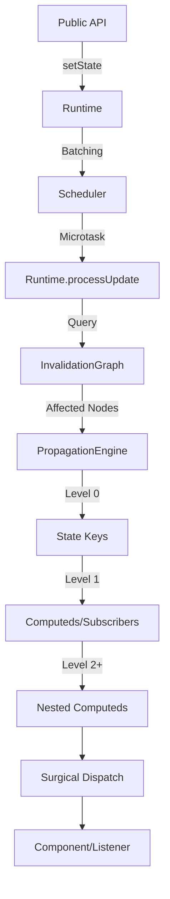

import CodeBlock from '@theme/CodeBlock';
import { Admonition } from '@site/src/components/Admonition';

# Internals: Core Engine Architecture

SoulState's engine is designed for deterministic updates, high-performance dispatch, and extreme scalability. It separates state management, dependency tracking, and update orchestration into distinct, optimized modules that form a **Reactive Graph Runtime**.

## Architecture Overview

SoulState's runtime architecture consists of six primary components:

1.  **StoreApi**: The public interface (`getState`, `setState`, `subscribe`, `computed`).
2.  **Runtime**: The central orchestrator (in `src/core/runtime.ts`) that manages the state transition and coordination pipeline.
3.  **InvalidationGraph**: A Directed Acyclic Graph (DAG) for tracking state-to-subscriber and state-to-computed relationships (in `src/internals/graph.ts`).
4.  **PropagationEngine**: A topological level-based dispatch system (in `src/internals/propagation.ts`).
5.  **SubscriptionManager**: A high-performance dual linked-list system for global and granular subscribers (in `src/core/subscriptions.ts`).
6.  **Scheduler**: A deterministic microtask-based batching engine (in `src/core/scheduler.ts`).

## The Runtime Orchestrator

The `Runtime` class is the nervous system of SoulState. It manages the current and previous states and ensures that updates are batched and dispatched with systems-grade precision.

### The Update Pipeline

When `setState` is called, the following happens:

1.  **State Apply**: The new partial state is applied immediately to the internal state tree.
2.  **Key Detection**: SoulState identifies which top-level keys changed.
3.  **Scheduling**: An update is requested via the `Scheduler`.
4.  **Topological Propagation**: During the flush phase, the `PropagationEngine` traverses the `InvalidationGraph` in level order.

<CodeBlock language="typescript">
{`// src/core/runtime.ts (simplified logic)
processUpdate() {
  const currentState = this.state;
  const flushId = ++this.flushId;

  // Step 1: Query the graph for affected nodes sorted by Level
  const affectedByLevel = this.propagation.process(this.changedKeys, flushId);
  this.changedKeys.clear();

  // Step 2: Level-by-level propagation (Topological Order)
  if (affectedByLevel) {
    for (const nodes of affectedByLevel) {
      if (!nodes) continue;
      for (const node of nodes) {
        this.dispatch(node, currentState);
      }
    }
  }
}`}
</CodeBlock>

## Invalidation Graph & Surgical Precision

SoulState uses an **Invalidation Graph** to map dependencies. Unlike global-broadcast systems, it knows exactly which leaf nodes in the tree are affected by a change at level 0.

### Topological Leveling
To prevent "glitches" (inconsistent state views), every node in the graph is assigned a level:
- **State Keys**: Level 0.
- **Computeds** that depend directly on state are Level 1.
- **Computeds** that depend on other Computeds are Level 2, 3, etc.
- **Subscribers** are assigned levels based on their specific dependency chain.

Updates are processed level-by-level, ensuring that a node only executes after all its own dependencies have settled.

## Runtime Observability

SoulState includes built-in metrics tracking via `RuntimeMetrics` (in `src/internals/metrics.ts`). This system records:
- **Flush Durations**: Time taken to propagate an update.
- **Selector Runs**: Number of times selectors are executed per flush.
- **Invalidations**: Number of nodes invalidated in the graph.

These metrics can be exposed via `store.getMetrics()` or used with `enableInstrumentation` for real-time profiling of your systems-grade runtime.
