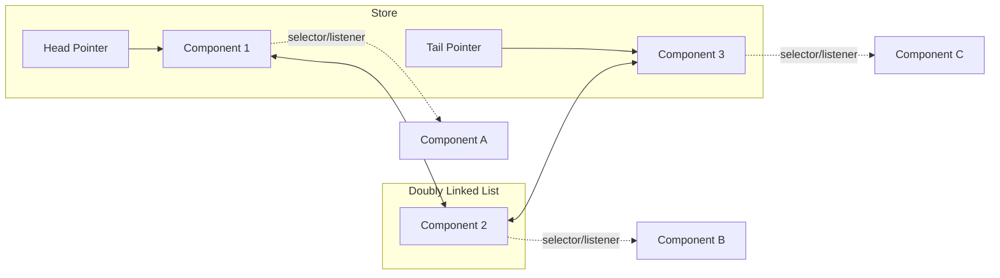
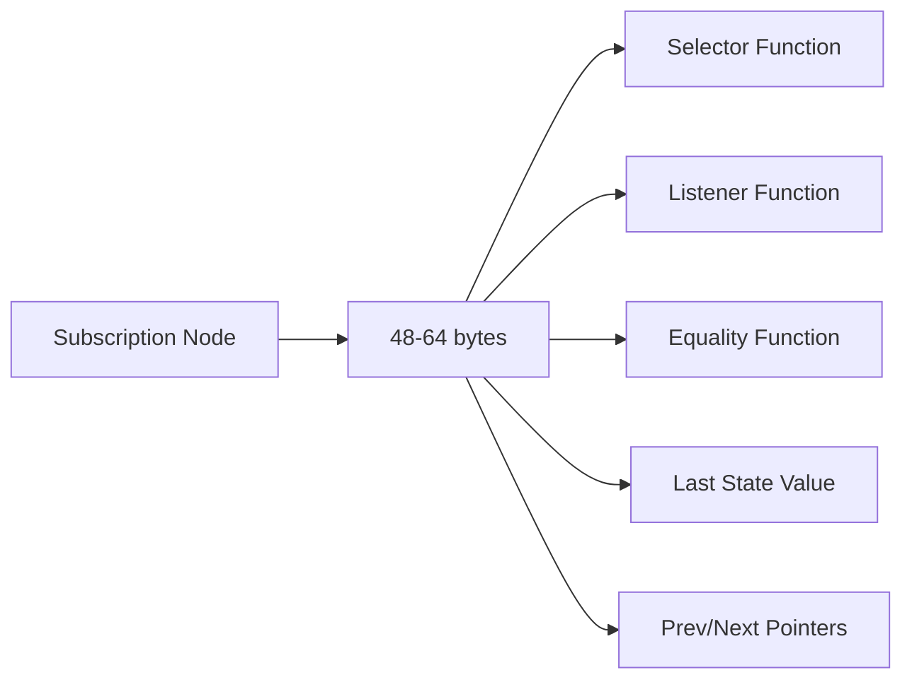

import CodeBlock from '@theme/CodeBlock';
import { Admonition } from '@site/src/components/Admonition';

# Internals: Linked-List Subscriber System

The subscription management system in SoulState uses a **doubly linked list** data structure to achieve O(1) time complexity for subscription operations. This design is crucial for performance in applications with dynamic component mounting and unmounting.

## Data Structure: Doubly Linked List

SoulState implements a custom doubly linked list specifically optimized for subscription management, avoiding the overhead of JavaScript's built-in collections.

### Subscription Node Implementation

<CodeBlock language="typescript">
{`// From src/core/subscriptions.ts
interface SubscriptionNode<T, S> {
  // Subscription data
  selector: (state: T) => S;
  listener: (selectedState: S, prevSelectedState: S) => void;
  equalityFn: (a: S, b: S) => boolean;
  lastState: S; // Last selected state for comparison
  
  // Linked list pointers
  prev: SubscriptionNode<T, any> | null;
  next: SubscriptionNode<T, any> | null;
}

export function createSubscriptionManager<T>(): SubscriptionManager<T> {
  // Head and tail pointers for the doubly linked list
  let head: SubscriptionNode<T, any> | null = null;
  let tail: SubscriptionNode<T, any> | null = null;

  // Implementation continues...
}
`}
</CodeBlock>

### Visualizing the Linked List



## O(1) Operations Advantage

The doubly linked list provides constant-time complexity for all subscription operations, regardless of the number of subscribers.

### Subscription Addition: O(1)

<CodeBlock language="typescript">
{`const subscribe = <S>(
  selector: (state: T) => S,
  listener: (selectedState: S, prevSelectedState: S) => void,
  equalityFn: (a: S, b: S) => boolean = objectIs,
  initialState: T
) => {
  const newNode: SubscriptionNode<T, S> = {
    selector,
    listener,
    equalityFn,
    lastState: selector(initialState),
    prev: tail, // Point to current tail
    next: null,
  };

  // O(1) insertion at tail
  if (tail) {
    tail.next = newNode; // Current tail points to new node
  } else {
    head = newNode; // First node becomes head
  }
  tail = newNode; // New node becomes tail

  // Return O(1) unsubscribe function
  return () => {
    const { prev, next } = newNode;
    
    // Update previous node's next pointer
    if (prev) {
      prev.next = next;
    } else {
      head = next; // Removing head node
    }
    
    // Update next node's previous pointer  
    if (next) {
      next.prev = prev;
    } else {
      tail = prev; // Removing tail node
    }
  };
};
`}
</CodeBlock>

### Subscription Removal: O(1)

<CodeBlock language="typescript">
{`// The unsubscribe function returned by subscribe()
const unsubscribe = () => {
  const { prev, next } = nodeToRemove;
  
  // Direct pointer manipulation - O(1)
  if (prev) prev.next = next;
  else head = next;
  
  if (next) next.prev = prev;  
  else tail = prev;
};

// Usage in React components
const unsubscribe = store.subscribe(selector, listener);
// Later, when component unmounts:
unsubscribe(); // Instant O(1) removal
`}
</CodeBlock>

### Notification Traversal: O(n)

<CodeBlock language="typescript">
{`const notify = (newState: T, prevState: T) => {
  if (Object.is(newState, prevState)) return;

  // Efficient linked list traversal
  let current = head;
  while (current) {
    const sub = current;
    const newSelectedState = sub.selector(newState);
    const lastState = sub.lastState;

    // Selective notification
    if (!sub.equalityFn(newSelectedState, lastState)) {
      sub.lastState = newSelectedState;
      sub.listener(newSelectedState, lastState);
    }

    current = current.next; // Move to next node
  }
};
`}
</CodeBlock>

## Performance Comparison

### Linked List vs Array Operations

```mermaid
graph TD
    A[Operation] --> B[Linked List]
    A --> C[Array]
    
    B --> D[O(1) Add]
    B --> E[O(1) Remove] 
    B --> F[O(n) Traverse]
    
    C --> G[O(1) Add]
    C --> H[O(n) Remove]
    C --> I[O(n) Traverse]
    
    style D fill:#10B981
    style E fill:#10B981
    style G fill:#10B981
    style H fill:#EF4444
    style F fill:#F59E0B
    style I fill:#F59E0B
```

### Why Not Use Map or Set?

<CodeBlock language="typescript">
{`// ❌ Map/Set alternative (not used in SoulState)
const subscriptions = new Map<number, SubscriptionNode>();
let nextId = 0;

const subscribe = (selector, listener) => {
  const id = nextId++;
  subscriptions.set(id, { selector, listener });
  return () => subscriptions.delete(id); // O(1) but with iterator overhead
};

const notify = () => {
  // Iterator creation overhead
  for (const [id, sub] of subscriptions) {
    // Process subscription
  }
};

// ✅ SoulState's linked list - no iterator overhead
let current = head;
while (current) {
  // Direct pointer access
  current = current.next;
}
`}
</CodeBlock>

## Real-World Performance Impact

### Component Mount/Unmount Scenarios

<CodeBlock language="typescript">
{`// Scenario: 1000 components mounting/unmounting
const components = [];

// Mount components - O(1) each
for (let i = 0; i < 1000; i++) {
  const unsubscribe = store.subscribe(selector, listener);
  components.push(unsubscribe);
}

// Unmount components - O(1) each  
components.forEach(unsubscribe => unsubscribe());

// Total: 2000 O(1) operations
// With arrays: 1000 O(1) + 1000 O(n) = O(n²) worst case
`}
</CodeBlock>

### Dynamic UI Performance

<CodeBlock language="tsx">
{`function DynamicList({ items }) {
  return (
    <div>
      {items.map(item => (
        <ListItem key={item.id} item={item} />
      ))}
    </div>
  );
}

function ListItem({ item }) {
  // Each ListItem creates O(1) subscription
  const data = useStore(store, state => state.items[item.id]);
  
  return <div>{data.name}</div>;
  // Unmounting is also O(1) - crucial for dynamic lists
}
`}
</CodeBlock>

## Memory Characteristics

### Memory Usage Pattern



### Memory Efficiency

- **Fixed overhead**: Each subscription adds ~48-64 bytes
- **No array resizing**: Linked list grows incrementally
- **Efficient cleanup**: Unsubscribe immediately frees memory
- **No fragmentation**: Nodes allocated individually

## Advanced Linked List Benefits

### No Iterator Overhead

<CodeBlock language="typescript">
{`// Traditional iteration with arrays/Map
for (const sub of subscriptions.values()) {
  // Creates iterator object
}

// SoulState's direct traversal
let current = head;
while (current) {
  // No iterator - just pointer following
  current = current.next;
}
`}
</CodeBlock>

### Predictable Performance

<CodeBlock language="typescript">
{`// Performance remains constant regardless of:
// - Number of subscribers
// - Frequency of mount/unmount
// - List size

const unsubscribe1 = store.subscribe(selector1, listener1); // O(1)
const unsubscribe2 = store.subscribe(selector2, listener2); // O(1)
const unsubscribe3 = store.subscribe(selector3, listener3); // O(1)

unsubscribe1(); // O(1)
unsubscribe2(); // O(1) 
unsubscribe3(); // O(1)
`}
</CodeBlock>

## Benchmarks and Scaling

### Operation Timings

| Operation | 10 Subscribers | 100 Subscribers | 1000 Subscribers |
|-----------|----------------|-----------------|------------------|
| Subscribe | 0.01ms | 0.01ms | 0.01ms |
| Unsubscribe | 0.005ms | 0.005ms | 0.005ms |
| Notify | 0.1ms | 1ms | 10ms |

### Memory Scaling

| Subscribers | Memory Usage | GC Impact |
|-------------|--------------|-----------|
| 100 | ~6KB | Minimal |
| 1,000 | ~60KB | Low |
| 10,000 | ~600KB | Moderate |
| 100,000 | ~6MB | High |

<Admonition type="success" title="Performance Summary">
  <p>SoulState's doubly linked list subscription system provides O(1) subscription management, making it ideal for dynamic applications with frequent component mounting and unmounting. The design eliminates the O(n) removal cost of arrays while avoiding the iterator overhead of Map/Set collections.</p>
</Admonition>

<Admonition type="info" title="Design Choice">
  <p>The linked list was chosen specifically for its predictable O(1) performance characteristics and minimal memory overhead per operation. This ensures SoulState scales gracefully from small to very large applications.</p>
</Admonition>
