import CodeBlock from '@theme/CodeBlock';
import { Admonition } from '@site/src/components/Admonition';

# Internals: Linked-List Subscriber System

The "subscription graph" is the data structure that holds all active subscriptions in a SoulState store. The efficiency of this graph is paramount for the library's performance, especially in applications with thousands of components mounting and unmounting.

## Data Structure: Doubly Linked List

SoulState does **not** use an array to store subscriptions. Instead, it uses a **doubly linked list**.

A doubly linked list is a sequence of nodes where each node contains:
- The subscription data (selector, listener, etc.).
- A pointer to the `next` node in the list.
- A pointer to the `previous` node in the list.

The store only keeps track of the `head` (first) and `tail` (last) nodes.

### Subscription Node Interface

<CodeBlock language="typescript">
{`interface SubscriptionNode<T, S> {
  // The actual subscription logic
  selector: (state: T) => S;
  listener: (selectedState: S, prevSelectedState: S) => void;
  equalityFn: (a: S, b: S) => boolean;
  lastState: S; // The last seen state slice, for comparison

  // Linked list pointers
  prev: SubscriptionNode<T, any> | null;
  next: SubscriptionNode<T, any> | null;
}
`}
</CodeBlock>

### Visualizing the Graph

Imagine three components are mounted and subscribed to the store. The subscription graph would look like this:

```mermaid
graph TD
    subgraph Store
        direction LR
        Head --> Node1
        Tail --> Node3
    end

    subgraph "Linked List"
        direction LR
        Node1(Node 1) <--> Node2(Node 2) <--> Node3(Node 3)
    end
    
    subgraph Components
        Comp1[Component A] --> Node1
        Comp2[Component B] --> Node2
        Comp3[Component C] --> Node3
    end

    style Store fill:#18181B,stroke:#3B82F6
```

## The O(1) Advantage

The choice of a doubly linked list provides a significant performance benefit: **O(1) time complexity for additions and removals.**

### Subscribing (Adding a Node)

When a new component subscribes (e.g., on mount):
1. A new `SubscriptionNode` is created.
2. Its `prev` pointer is set to the current `tail`.
3. The current `tail`'s `next` pointer is updated to the new node.
4. The store's `tail` pointer is updated to the new node.

This is a handful of pointer assignments, which is a constant-time operation. It doesn't matter if there are 10 or 10,000 subscribers; the cost is the same.

### Unsubscribing (Removing a Node)

When a component unsubscribes (e.g., on unmount), the `unsubscribe` function (which is a closure over the node) performs the following:
1. It accesses its `prev` and `next` neighbors directly.
2. It sets `prev.next = next`.
3. It sets `next.prev = prev`.

This "splices" the node out of the list in constant time.

<Admonition type="danger" title="The Problem with Arrays">
  
If subscriptions were stored in an array, unsubscribing would require finding the subscription in the array (<code>Array.prototype.find</code>) and then removing it (<code>Array.prototype.splice</code> or <code>Array.prototype.filter</code>). This is an <strong>O(n)</strong> operation. In a large application, this could lead to noticeable slowdowns during route changes or when many components unmount simultaneously. The linked list completely avoids this bottleneck.

</Admonition>

### Notification (Iterating the Graph)

During the notification phase, the store starts at the `head` and iterates through the list by following the `next` pointers until it reaches `null`. This is a simple, fast traversal with no iterator allocation overhead.

<CodeBlock language="typescript">
{`// from src/core/subscriptions.ts

const notify = (newState: T, prevState: T) => {
  // Start at the beginning of the list
  let current = head;
  
  // Walk the list until the end
  while (current) {
    const sub = current;
    
    // ... run selector and equality check ...
    
    // Move to the next node
    current = current.next;
  }
};
`}
</CodeBlock>
