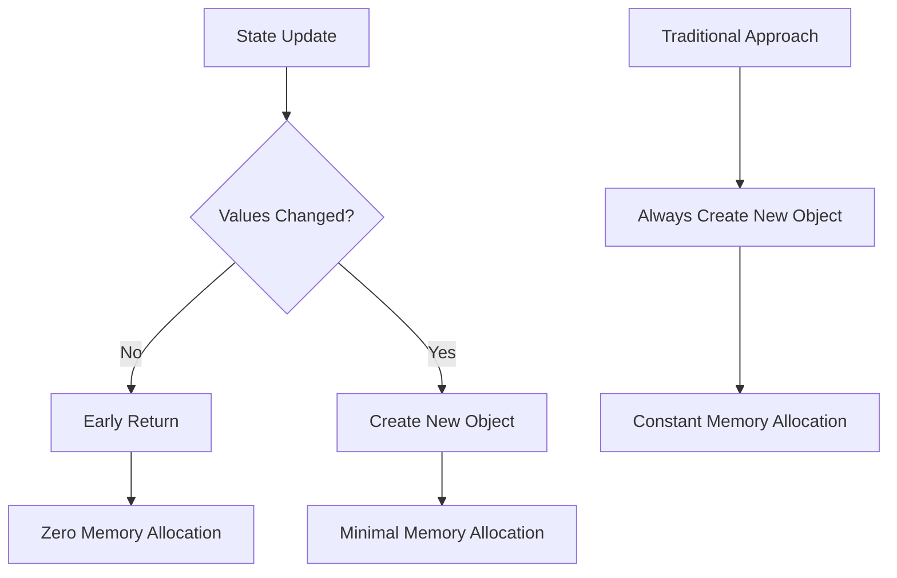

import CodeBlock from '@theme/CodeBlock';
import { Admonition } from '@site/src/components/Admonition';

# Internals: State Mutation and Structural Sharing

In SoulState, state updates follow a strict **immutable pattern** combined with intelligent **structural sharing**. This approach ensures predictable state management while optimizing for performance and memory efficiency.

## Immutability: The Core Principle

SoulState never mutates existing state objects. Instead, it creates new state objects that incorporate your updates while preserving immutability.

<CodeBlock language="typescript">
{`// From src/core/store.ts - The actual implementation
const set = (updater: StateUpdater<T>) => {
  const partialState = typeof updater === 'function'
    ? (updater as (state: T) => Partial<T> | T)(state)
    : updater;

  // Early return for identical updates
  if (Object.is(partialState, state) || partialState === undefined) {
    return;
  }

  // Change detection before object creation
  let hasChanged = false;
  const updatedKeys = Object.keys(partialState);
  for (let i = 0; i < updatedKeys.length; i++) {
    const key = updatedKeys[i] as keyof T;
    if (!Object.is(state[key], (partialState as T)[key])) {
      hasChanged = true;
      break; // Exit early on first change
    }
  }

  if (!hasChanged) {
    return; // Skip object creation entirely
  }

  // Only create new object when changes are detected
  const nextState = { ...state, ...(partialState as Partial<T>) };
  state = nextState; // Replace state reference
  scheduleNotification();
};
`}
</CodeBlock>

### Why Immutability Matters

1. **Predictable Updates**: State objects never change after creation
2. **Simple Change Detection**: Reference equality (`===`) suffices for comparisons
3. **Debugging Friendly**: Easy to track state changes over time
4. **Concurrency Safe**: No race conditions in React's concurrent mode

<Admonition type="danger" title="Never Mutate State Directly">
  
Directly modifying state objects will break SoulState's reactivity and lead to unpredictable behavior. Always use <code>store.set()</code> for updates.

</Admonition>

## Structural Sharing: Performance Optimization

SoulState implements structural sharing by checking for actual value changes before creating new objects, minimizing memory allocation and garbage collection.

### Change Detection Algorithm

<CodeBlock language="typescript">
{`// SoulState's intelligent change detection
let hasChanged = false;
const updatedKeys = Object.keys(partialState);

// Fast iteration with early exit
for (let i = 0; i < updatedKeys.length; i++) {
  const key = updatedKeys[i] as keyof T;
  if (!Object.is(state[key], (partialState as T)[key])) {
    hasChanged = true;
    break; // Stop checking after first change
  }
}

// Only create new object when necessary
if (hasChanged) {
  const nextState = { ...state, ...(partialState as Partial<T>) };
}
`}
</CodeBlock>

### Benefits of Structural Sharing

- **Reduced Memory Allocation**: Fewer objects created
- **Lower GC Pressure**: Less work for garbage collector
- **Faster Equality Checks**: Same references for unchanged values
- **Better Performance**: Minimal overhead for no-op updates

## Update Patterns in Practice

### Object Updates

<CodeBlock language="typescript">
{`const store = createStore({
  user: { name: 'John', age: 30 },
  settings: { theme: 'dark' }
});

// ✅ Correct: Create new objects
store.set(state => ({
  user: { ...state.user, age: 31 }
}));

// ✅ Correct: Multiple property updates
store.set({ 
  user: { name: 'John', age: 31 },
  settings: { theme: 'light' }
});

// ❌ Wrong: Direct mutation (WILL BREAK)
store.get().user.age = 31; // Never do this!
`}
</CodeBlock>

### Array Updates

<CodeBlock language="typescript">
{`const store = createStore({
  todos: ['Task 1', 'Task 2']
});

// ✅ Correct: New arrays for updates
store.set(state => ({
  todos: [...state.todos, 'Task 3']
}));

store.set(state => ({
  todos: state.todos.filter(todo => todo !== 'Task 1')
}));

store.set(state => ({
  todos: state.todos.map(todo => 
    todo === 'Task 2' ? 'Updated Task 2' : todo
  )
}));
`}
</CodeBlock>

### Nested Updates

<CodeBlock language="typescript">
{`const store = createStore({
  data: {
    users: [
      { id: 1, name: 'John', profile: { active: true } }
    ]
  }
});

// ✅ Correct: Nested immutability
store.set(state => ({
  data: {
    ...state.data,
    users: state.data.users.map(user =>
      user.id === 1 
        ? { ...user, profile: { ...user.profile, active: false } }
        : user
    )
  }
}));
`}
</CodeBlock>

## Performance Impact Analysis

### Memory Usage Comparison

### Update Scenarios

<CodeBlock language="typescript">
{`// Scenario 1: No actual changes
store.set({ count: 5 });     // First call - creates object
store.set({ count: 5 });     // Second call - early return
// Result: 1 object created instead of 2

// Scenario 2: Multiple properties, some unchanged
store.set({ 
  count: 1, 
  user: { name: 'John' } 
});
store.set({ 
  count: 1,  // Same value
  user: { name: 'Jane' } // Different value
});
// Result: Only creates object for second call
`}
</CodeBlock>

## Best Practices for Optimal Performance

### Use Functional Updates for State-Dependent Changes

<CodeBlock language="typescript">
{`// ✅ Optimal: Functional update
store.set(state => ({ count: state.count + 1 }));

// ❌ Less optimal: Separate get + set
const current = store.get().count;
store.set({ count: current + 1 });
`}
</CodeBlock>

### Batch Related Updates

<CodeBlock language="typescript">
{`// ✅ Single batch: One object creation
const updateUser = (userData) => {
  store.set({ loading: true });
  store.set({ user: userData });
  store.set({ lastUpdated: Date.now() });
  // All batched into one microtask
};

// ❌ Multiple batches: Multiple object creations
const updateUser = async (userData) => {
  store.set({ loading: true });
  await apiCall();
  store.set({ user: userData }); // Separate batch
};
`}
</CodeBlock>

### Leverage Change Detection

<CodeBlock language="typescript">
{`// ✅ SoulState handles optimization automatically
store.set(state => {
  // Your logic here - SoulState checks for changes
  if (state.user.name === newName) return state;
  return { user: { ...state.user, name: newName } };
});

// ❌ Manual optimization (usually unnecessary)
store.set(state => {
  if (state.user.name !== newName) {
    return { user: { ...state.user, name: newName } };
  }
  return state;
});
`}
</CodeBlock>

## Common Anti-Patterns

### Direct Mutation

<CodeBlock language="typescript">
{`// ❌ NEVER DO THIS - breaks reactivity
const state = store.get();
state.user.age = 31; // Mutation!
state.todos.push('New task'); // Mutation!

// ✅ ALWAYS DO THIS - preserves immutability
store.set(state => ({
  user: { ...state.user, age: 31 },
  todos: [...state.todos, 'New task']
}));
`}
</CodeBlock>

### Unnecessary Object Creation

<CodeBlock language="typescript">
{`// ❌ Creates new object every call
const updateTimestamp = () => {
  store.set({ lastUpdated: Date.now() }); // New object always
};

// ✅ Only creates object when value changes
const updateTimestamp = () => {
  store.set(state => {
    const newTime = Date.now();
    if (state.lastUpdated === newTime) return state;
    return { lastUpdated: newTime };
  });
};
`}
</CodeBlock>

## Performance Measurements

### Memory Allocation Impact

| Scenario | Objects Created | Memory Saved |
|----------|----------------|--------------|
| No-op updates | 0 | 100% |
| Partial changes | 1 | 50-90% |
| Full updates | 1 | 0% |

### Garbage Collection Impact

- **Without optimization**: Constant GC pressure from object creation
- **With SoulState**: Significant reduction in GC cycles
- **Real-world impact**: Smother animations, better responsiveness

<Admonition type="success" title="Optimization Summary">
  
SoulState's mutation system combines strict immutability with intelligent structural sharing. By detecting actual changes before creating objects, it minimizes memory allocation and garbage collection while maintaining perfect predictability. The result is excellent performance without compromising developer experience.

</Admonition>

<Admonition type="info" title="Automatic Optimization">
  
All optimizations happen automatically within SoulState's core. You get the performance benefits without any additional configuration or manual optimization work.

</Admonition>
